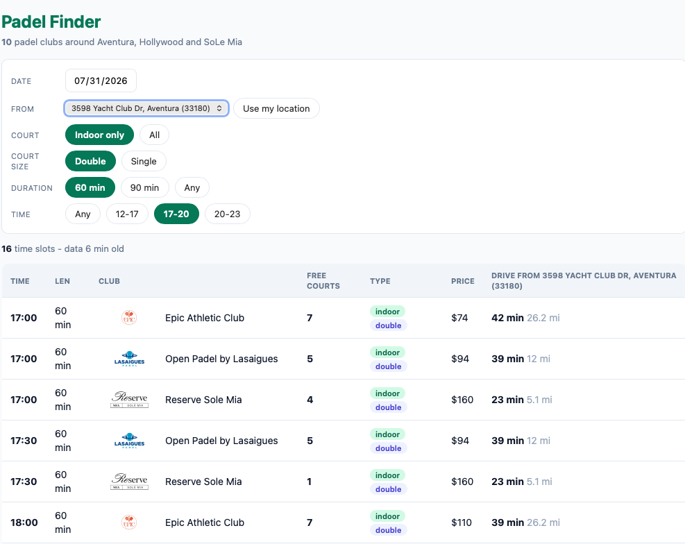

# Padel Finder

A small FastAPI app that shows padel court availability and travel time to each club.
The sample data is for the Miami area.



## What is included

- FastAPI API and a static web UI
- Playwright scraper for Playtomic pages
- Snapshot fallback when live data is unavailable
- Optional Kubernetes cache
- Drive-time matrix using OSRM, TomTom or Mapbox
- Browser geolocation with a cached OSRM lookup

## Run locally

Python 3.12 is recommended.

```bash
python3 -m venv .venv
. .venv/bin/activate
pip install -r requirements.txt
uvicorn app.main:app --reload --port 8080
```

Open <http://127.0.0.1:8080/>.

The app starts with the bundled sample data. Useful endpoints:

```bash
curl -s http://127.0.0.1:8080/api/health | jq
curl -s 'http://127.0.0.1:8080/api/slots?date=2026-07-30&indoor=true&duration=60' | jq
```

## Run with Docker

```bash
make build
make run
```

Open <http://127.0.0.1:18080/>. Stop the container with `make stop`.

## Live availability

The scraper uses Playwright because direct calls to some Playtomic endpoints may be
rejected. It reads public pages by default.

For authenticated fetching, provide credentials at runtime. Do not commit them.

```bash
export PLAYTOMIC_EMAIL='you@example.com'
export PLAYTOMIC_PASSWORD='...'
```

The scraper can be configured with `API_INGEST`, `CENTER_COORD`, `RADIUS_MILES`,
`DAYS_AHEAD` and `OVERRIDES_FILE`.

Check the current Playtomic terms and access rules before running the scraper regularly.

## Drive times

`/api/drive` serves the checked-in sample matrix. Generate a new matrix with:

```bash
# Free-flow route times, no key required
python3 scripts/gen_drive.py --provider osrm

# Traffic-aware route times
DRIVE_TRAFFIC=1 \
TOMTOM_API_KEY="$TOMTOM_API_KEY" \
python3 scripts/gen_drive.py \
  --provider tomtom \
  --i-know-this-spends-quota
```

The generator limits the number of calls per run, day and month. It also keeps a local
ledger, uses a lock, and stops on repeated failures. Review the provider's current
pricing and limits before using a paid provider.

## Kubernetes

The Helm chart is in `helm/padel/`. The default values are deliberately conservative:
Ingress, live scraping, Playtomic credentials and the traffic CronJob are disabled.
Override the image and enable only the components you need.

```bash
make lint
make template NAMESPACE=padel-finder
make push IMAGE=ghcr.io/YOUR_USER/padel-finder TAG=0.1.0
make deploy IMAGE=ghcr.io/YOUR_USER/padel-finder TAG=0.1.0 \
  NAMESPACE=padel-finder KUBE_CONTEXT=your-context
```

Create credentials outside Helm:

```bash
kubectl -n padel-finder create secret generic padel-playtomic \
  --from-literal=email="$PLAYTOMIC_EMAIL" \
  --from-literal=password="$PLAYTOMIC_PASSWORD"

kubectl -n padel-finder create secret generic padel-drive-tokens \
  --from-literal=TOMTOM_API_KEY="$TOMTOM_API_KEY"
```

## Repository layout

```text
app/                  FastAPI app, UI and sample data
scraper/              Playwright scraper and warm scraper service
scripts/gen_drive.py  Drive-time matrix generator
scripts/publish_drive.py
helm/padel/           Kubernetes Helm chart
```

## Notes

- `/api/ingest` is intended for trusted internal callers. Protect it before exposing it publicly.
- The sample catalogue, logos and availability data come from third parties. Check their
  redistribution terms before changing the repository's public contents.
- Source code is MIT licensed. See `LICENSE` and `NOTICE.md`.
